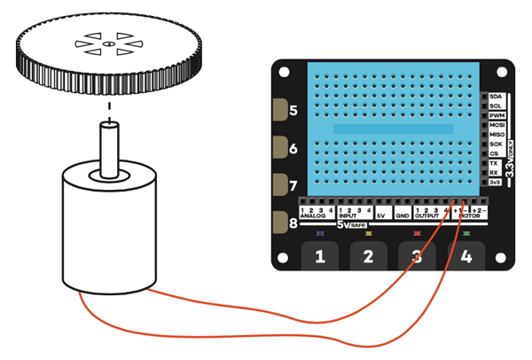

## Prepare your motor and wheel

It is likely that your motors and wheels have been supplied separately and will therefore need to be connected in order for you to use them.

  

- Place the wheel on a desk or table. Align the shaft of the motor with the wheel and press it gently until it is about half way into the wheel. If you are using a wheel which does not fit snugly onto the motor shaft, you may need to use a small amount of strong glue to attach it.

  

- Next, take two female-to-male jumper cables and attach the female end to the prongs on the motor. If you are using a motor which does not have attachments for jumper leads already attached, you will need to strip the jumper leads and solder them to the motor's connectors.

  

- Take a paper or plastic cup and, using some scissors or a sharp pencil, make a hole in the middle just a little smaller than the size of the motor.

- Push your motor into the hole in the cup, so that the wheel sticks out of the bottom and the jumper wires come out of the top.

- Turn your cup upside down on the table and connect the two jumper wires to your Explorer HAT board. Place one of the male connectors into **Motor 1 +**, and the other adjacent to it, in **Motor 1 -**. In this case it does not matter which way around you connect the wires.

    

