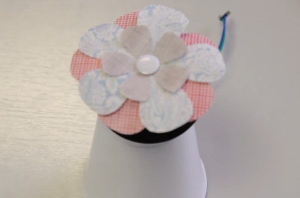

## Decorate your wheel with a flower or pinwheel

Now that you have constructed your motor, it is time to decorate it. You can do this by cutting out flower shapes from different coloured paper or felt. Alternatively, you could make an [origami pinwheel out of paper](http://www.wikihow.com/Make-an-Origami-Pinwheel).

- Place a ball of Blu Tack in the centre of the wheel.

- Add your flower or pinwheel on top of the Blu Tack, ensuring that it is in the middle.

- Secure the paper in place with a push pin.

- You could get really creative with some wire to add insects like bumble bees around the outside! Remember the wheel is going to spin, so how could you take advantage of this in a creative way?

    

