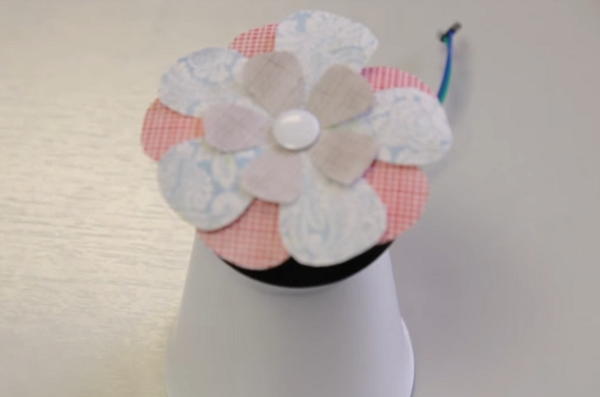

## Décorer ta roue avec une fleur ou un moulin à vent

Maintenant que tu as construit ton moteur, il est temps de le décorer. Tu peux le faire en découpant des formes de fleurs à partir de papier ou de feutre de couleur différente. Tu peux également fabriquer un [moulin à vent en papier](http://www.wikihow.com/Make-an-Origami-Pinwheel).

- Place une boule de Super Glue au centre de la roue.

- Ajoute ta roue ou moulin à vent au dessus de la Super Glue, en veillant à ce que se soit au milieu.

- Fixe le papier avec une punaise.

- Tu peux être très créatif avec du fil de fer pour ajouter des insectes comme des bourdons à l'extérieur ! N'oublie pas que la roue va tourner, alors comment peux-tu en tirer parti de manière créative ?
    
    