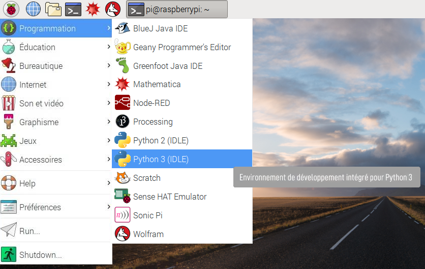

## Écrire le code pour faire tourner le moteur

Une fois que la roue et les moteurs ont été assemblés et fixés à l'Explorer HAT, il est temps de les programmer pour faire ce pour quoi ils ont été conçu... tourner!

- Depuis le menu `Programmation` , ouvre `Python 3 (IDLE)`
    
    

- Clique sur **Fichier** > **Nouveau fichier** pour créer un fichier vide.

- Commence ton code en important la bibliothèque Explorer HAT nécessaire pour contrôler le moteur en tapant :
    
    ```python
    import explorerhat
    ```

- En dessous, importe la fonction sleep de `time` afin que tu puisses ajouter des délais à ton programme :
    
    ```python
    from time import sleep
    ```

- Maintenant, ajoute la séquence d'instructions pour contrôler le moteur attaché :
    
    ```python
    explorerhat.motor.one.forward(100)
    sleep(10)
    explorerhat.motor.one.stop()
    ```

- Enregistre ton code et exécute le programme en appuyant sur **F5** sur le clavier. Ton programme devrait allumer le moteur, ce qui fera tourner l'arbre connecté à la roue pendant dix secondes. Comment faire pour qu'il tourne plus longtemps ?