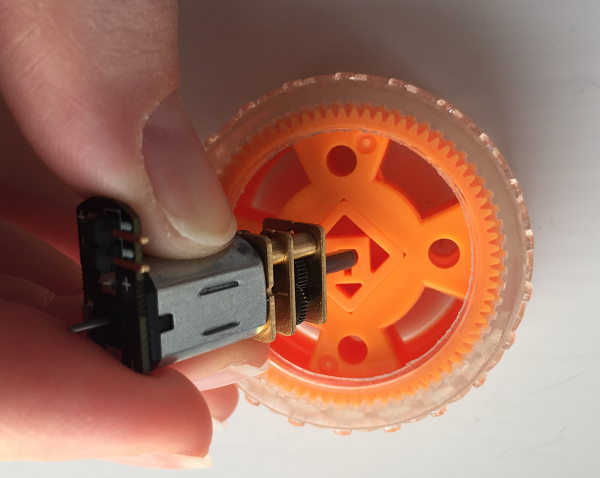

## अपनी मोटर और पहिया तैयार करें

यह संभावना है कि आपके मोटर्स व पहियों की अलग-अलग आपूर्ति की गई होगी और इसलिए आपको उनका उपयोग करने के लिए, उन्हें जोड़ने की जरूरत है।

- पहिये को डेस्क या टेबल पर रखें। पहिया के साथ मोटर के शाफ्ट को संरेखित करें और इसे धीरे से दबाएं जब तक कि यह पहिये में लगभग आधा ना घुस जाए। यदि आप एक ऐसे पहिये का उपयोग कर रहे हैं, जो मोटर शाफ्ट पर पूरी तरह फिट नहीं हो रहा, तो आपको इसे जोड़ने के लिए थोड़े से मजबूत गोंद की जरुरत पड़ सकती है।
    
    

- इसके बाद, दो फीमेल-से-मेल जम्पर केबल (female-to-male jumper cable) लें और मोटर के काँटों पर फीमेल ओर से जोड़े। यदि आप एक ऐसी मोटर का उपयोग कर रहे हैं जिसमें जम्पर लीड्स (jumper leads) के लिए अटैचमेंट (attachment) नहीं हैं, तो आपको जम्पर लीड्स को हटाना होगा और उन्हें मोटर के कनेक्टर्स में टाँके से लगाना होगा।
    
    

- एक कागज या प्लास्टिक कप लें और, कैंची या एक तेज पेंसिल का उपयोग करके, उसके बीच में मोटर के आकार से थोड़ा छोटा एक छेद बनाएं।

- अपनी मोटर को कप के छेद में फसाएँ, ताकि पहिया नीचे से निकल जाए व जम्पर तार (jumper wires) ऊपर से बाहर आ जाएं।

- अपने कप को टेबल पर उल्टा रखें और दो जम्पर तारों (jumper wires) को अपने एक्सप्लोरर हैट बोर्ड (Explorer HAT board) में कनेक्ट करें। मेल कनेक्टर्स (Male connectors) में से एक को **मोटर 1+ (Motor 1+)** में रखें, और और दूसरे को, **मोटर 1- (Motor 1-)** में। यहाँ कोई फर्क नहीं पड़ता कि आप किस तरीके से तारों को जोड़ते हैं।
    
    