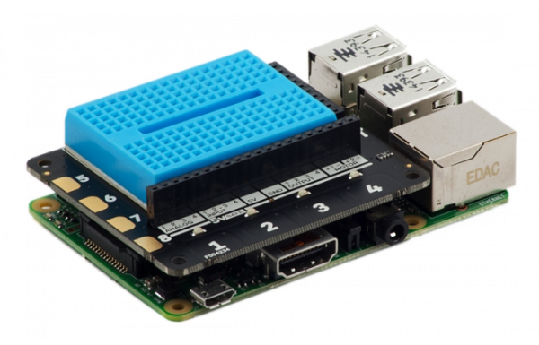

## ನಿಮ್ಮ Raspberry Pi ಗೆ Explorer HAT ಅನ್ನು ಲಗತ್ತಿಸಿ

- ನಿಮ್ಮ Raspberry Pi off ಆಗಿದೆಯೆ ಎಂದು ಖಚಿತಪಡಿಸಿಕೊಳ್ಳಿ. Explorer HAT ಅನ್ನು ನಿಮ್ಮ Raspberry Piಯೊಂದಿಗೆ ಸಂಪರ್ಕ ಪಡಿಸಲು ಅದನ್ನು GPIO ಪಿನ್ನಿನ ಜೊತೆ ಜೊಡಿಸಿ.
    
    

- Micro USB ವಿದ್ಯುತ್ ಸರಬರಾಜನ್ನು ಸಂಪರ್ಕಿಸಿ, ಇದರಿಂದ ನಿಮ್ಮ Raspberry Pi ಪ್ರಾರಂಭಗೊಳ್ಳುತ್ತದೆ.

- ಕೆಳಗಿನ ಆಜ್ಞೆಯನ್ನು(command) ಚಲಾಯಿಸಿ, Explorer HAT ಅನ್ನು ಸರಿಯಾಗಿ ಸ್ಥಾಪಿಸಿದ್ದೀರಾ ಎಂದು ಪರಿಶೀಲಿಸಿ:

```bash
python3 -c "import explorerhat"
```

ನೀವು `Explorer HAT Pro detected...` ಎಂಬ ಸಂದೇಶವನ್ನು ನೋಡದಿದ್ದರೆ, Explorer HAT ಸರಿಯಾಗಿ ಸ್ತಾಪಿಸಿದ್ದೀರಾ ಮತ್ತು ನೀವು ಮೇಲಿನ ಆಜ್ಞೆಯನ್ನು ಸರಿಯಾಗಿ ಚಲಾಯಿಸಿರುವಿರ ಎಂದು ಪರಿಶೀಲಿಸಿ.