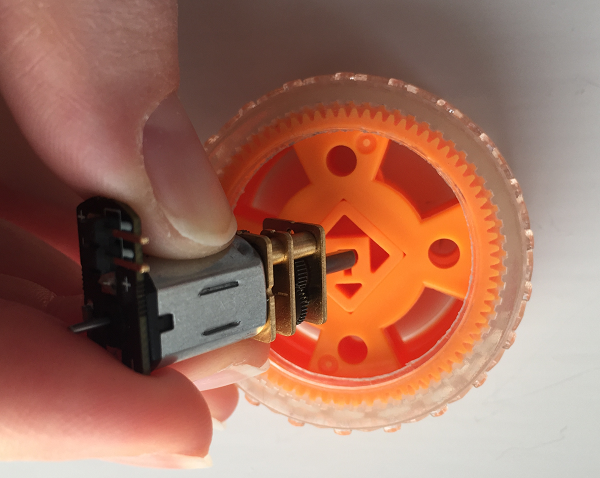

## ನಿಮ್ಮ ಮೋಟರ್ ಮತ್ತು ಚಕ್ರವನ್ನು ತಯಾರಿಸಿ

ನಿಮ್ಮ ಮೋಟರ್‌ಗಳು ಮತ್ತು ಚಕ್ರಗಳು ಪ್ರತ್ಯೇಕವಾಗಿ ದೊರೆತಿರುವುದರಿಂದ, ಅವುಗಳನ್ನು ಬಳಸಲು ಮೊದಲು ಅವುಗಳ ನಡುವೆ ಸಂಪರ್ಕ ಮೂಡಿಸಬೇಕು.

- ಚಕ್ರವನ್ನು ಮೇಜಿನ ಮೇಲೆ ಇರಿಸಿ. ಮೋಟರಿನ ಶಾಫ್ಟ್ ಅನ್ನು ಚಕ್ರದೊಂದಿಗೆ ಜೋಡಿಸಿ ಮತ್ತು ಅದು ಚಕ್ರದ ಅರ್ಧದವವರೆಗೆ ಬರುವ ತನಕ ಅದನ್ನು ನಿಧಾನವಾಗಿ ಒತ್ತಿರಿ. ನೀವು ಮೋಟರ್ ಶಾಫ್ಟ್ ಸರಿಯಾಗಿ ಹೊಂದಿಕೊಳ್ಳದ ಚಕ್ರವನ್ನು ಬಳಸುತ್ತಿದ್ದರೆ, ಅದನ್ನು ಜೊಡಿಸಲು ನೀವು ಸ್ವಲ್ಪ ಪ್ರಮಾಣದ ಬಲವಾದ ಅಂಟು ಬಳಸಬೇಕಾಗಬಹುದು.
    
    

- ನಂತರ, ಎರಡು female-to-male ಜಂಪರ್ ಕೇಬಲ್‌ಗಳನ್ನು ತೆಗೆದುಕೊಂಡು female ತುದಿಯನ್ನು ಮೋಟರ್‌ನಲ್ಲಿರುವ ಪ್ರಾಂಗ್‌ಗಳಿಗೆ ಜೋಡಿಸಿ. ನಿಮ್ಮ ಮೋಟರ್ ನಲ್ಲಿ ಜಂಪರ್ ಲೀಡ್ ಜೊಡಣೆಗೆ ವ್ಯವಸ್ಥೆ ಇಲ್ಲದ್ದಿದ್ದರೆ, ಜಂಪರ್ ಲೀಡ್ಗಳನ್ನು ಮೋಟರ್ ನ ಕನೆಕ್ಟರ್ ಗಳೊಂದಿಗೆ ನೇರವಾಗಿ ಬೆಸುಗೆ ಹಾಕಬೇಕು.
    
    

- ಕಾಗದ ಅಥವಾ ಪ್ಲಾಸ್ಟಿಕ್ ಕಪ್ ತೆಗೆದುಕೊಂಡು, ಅದರ ಮಧ್ಯದಲ್ಲಿ ಕತ್ತರಿ ಅಥವಾ ತೀಕ್ಷ್ಣವಾದ ಪೆನ್ಸಿಲ್ ಬಳಸಿ, ಮೋಟಾರಿನ ಗಾತ್ರಕ್ಕಿಂತ ಸ್ವಲ್ಪ ಚಿಕ್ಕದಾದ ರಂಧ್ರವನ್ನು ಮಾಡಿ.

- ನಿಮ್ಮ ಮೋಟರ್ ಅನ್ನು ಕಪ್‌ನ ರಂಧ್ರದೊಳಗೆ ತಳ್ಳಿರಿ, ಇದರಿಂದ ಚಕ್ರವು ಕೆಳಭಾಗದಿಂದ ಹೊರಬರುತ್ತದೆ ಮತ್ತು ಜಂಪರ್ ತಂತಿಗಳು ಮೇಲಿನಿಂದ ಹೊರಬರುತ್ತವೆ.

- ನಿಮ್ಮ ಕಪ್ ಅನ್ನು ಮೇಜಿನ ಮೇಲೆ ತಲೆಕೆಳಗಾಗಿ ತಿರುಗಿಸಿ ಮತ್ತು ಎರಡು ಜಂಪರ್ ತಂತಿಗಳನ್ನು ನಿಮ್ಮ ಎಕ್ಸ್‌ಪ್ಲೋರರ್ ಹ್ಯಾಟ್ (Explorer HAT) ಬೋರ್ಡ್‌ಗೆ ಸಂಪರ್ಕಪಡಿಸಿ. Male ಕನೆಕ್ಟರ್‌ಗಳಲ್ಲಿ ಒಂದನ್ನು **Motor 1 +** ಗೆ ಇರಿಸಿ, ಮತ್ತೊಂದನ್ನು ಅದರ ಪಕ್ಕದಲ್ಲಿರುವ **Motor 1 -** ಗೆ ಇರಿಸಿ. ಇಲ್ಲಿ ನೀವು ಎರಡರಲ್ಲಿ ಯಾವ ಜಂಪರ್ ವಯರ್ ಅನ್ನಾದರು ಮೋಟರ್ 1+ ಅಥವಾ ಮೋಟರ್ 1- ಗೆ ಸೇರಿಸಬಹುದು.
    
    