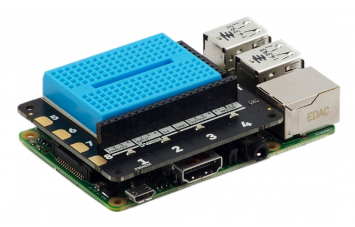

## आपल्या Raspberry Pi सह एक्सप्लोरर हॅट (Explorer HAT) जोडा

- आपला Raspberry Pi बंद असल्याचे सुनिश्चित करा. एक्सप्लोरर हॅट (Explorer HAT) ला आपल्या Raspberry Pi मध्ये GPIO pins सह कनेक्ट करा.
    
    

- मायक्रो USB उर्जा पुरवठा जोडा आणि आपला Raspberry Pi सुरू होईल.

- आपली Explorer HAT योग्यरित्या इनस्टॉल झाली आहे की नाही हे तपासण्यासाठी खालील आदेश Run करा:

```bash
python3 -c "import explorerhat"
```

जर आपल्याला हा मेसेज `Explorer HAT Pro detected...` दिसत नशील तर एक्सप्लोरर हॅट (Explorer HAT) माउंट (mount) आणि आपण वरील कमांड योग्य प्रकारे प्रविष्ट केला आहे की नाही ते तपासा.