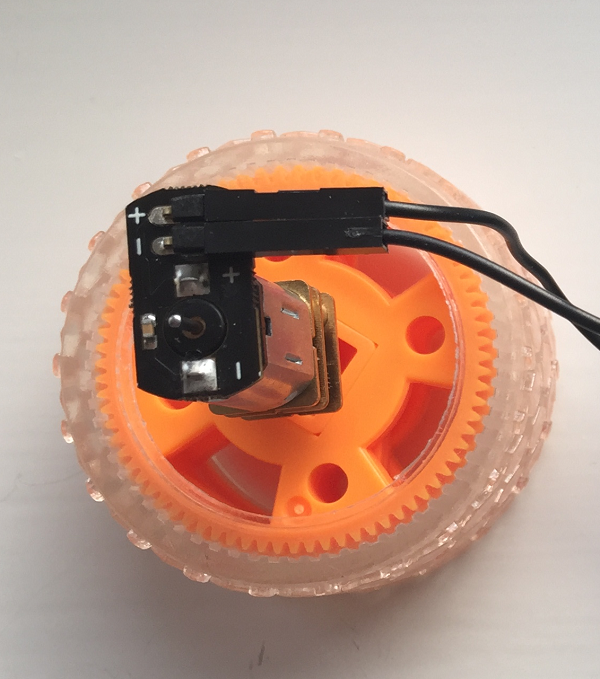

## आपली मोटर आणि चाक तयार करा

आपल्या मोटर आणि चाक स्वतंत्रपणे पुरविल्या गेल्या असतील आणि त्या वापरण्यासाठी आपल्याला त्यास कनेक्ट करणे आवश्यक आहे.

- चाक डेस्क किंवा टेबलवर ठेवा. चाकासह मोटरचा शाफ्ट संरेखित करा आणि चाकच्या जवळपास अर्ध्या मार्गावर येईपर्यंत हळू दाबा. आपण मोटर शाफ्टवर पूर्णपणे फिट नसणारी चाक वापरत असल्यास, त्यास जोडण्यासाठी आपणास थोडासा प्रमाणात मजबूत गोंद वापरण्याची आवश्यकता असू शकते.
    
    

- पुढे, दोन फीमेल-से-मेल जम्पर केबल केबल्स (female-to-male jumper cable) घ्या आणि फीमेलच्या बाजूला मोटरच्या हुकशी जोडा. जर आपण एखादी मोटार वापरत असाल ज्यामध्ये आधीपासूनच जोडलेल्या जंपर लीड्ससाठी अटॅचमेंट्स नसतील तर आपणास जम्पर लीड्स काढून टाकाव्या लागतील आणि त्या मोटरच्या कनेक्टरला हुकशी जोडा लागतील.
    
    

- एक कागद किंवा प्लास्टिकचा कप घ्या आणि, कात्री किंवा तीक्ष्ण पेन्सिल वापरुन, मध्यभागी मोटारच्या आकारापेक्षा लहान बनवा.

- आपली मोटर कपच्या भोकमध्ये सरकवा, जेणेकरून व्हील तळापासून बाहेर येईल आणि वरच्या बाजूला जम्पर वायर्स (jumper wires) बाहेर येतील.

- आपला कप वरच्या बाजूला टेबलवर ठेवा आणि दोन जम्पर वायर्स (jumper wires) आपल्या एक्सप्लोररच्या हॅट बोर्डशी (Explorer HAT board) जोडा. मेल कनेक्टर्स (Male connectors) मधील एकाला **Motor 1 +** मध्ये ठेवा आणि दुसरा **Motor 1 -** मध्ये ठेवा. आपण येथे तार कसे जोडता हे महत्वाचे नाही.
    
    