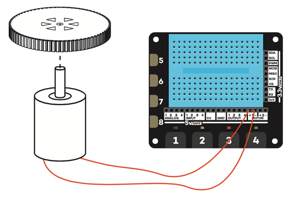

## Bereid je motor en wiel voor

Het is waarschijnlijk dat je motoren en wielen afzonderlijk zijn geleverd en daarom moeten ze worden gemonteerd zodat je ze kunt gebruiken.

- Plaats het wiel op een bureau of tafel. Lijn de as van de motor uit met het wiel en druk er zachtjes op tot het ongeveer halverwege het wiel zit. Als je een wiel gebruikt dat niet precies op de motoras past, moet je mogelijk een kleine hoeveelheid sterke lijm gebruiken om het vast te maken.
    
    

- Neem vervolgens twee vrouwelijk-naar-mannelijke snoertjes en bevestig het vrouwelijke uiteinde aan de aansluitingen op de motor. Als je een motor gebruikt die geen aansluiting voor jumpers heeft, moet je de jumperstekkers verwijderen en ze op de connectoren van de motor solderen.
    
    

- Neem een ​​papieren of plastic beker en maak met een schaar of een scherp potlood een gat in het midden dat net iets kleiner is dan het formaat van de motor.

- Duw je motor in het gat in de beker, zodat het wiel uit de bodem steekt en de jumperdraden uit de bovenkant komen.

- Draai je beker ondersteboven op de tafel en sluit de twee jumperdraden aan op je Explorer HAT-bord. Plaats een van de mannelijke connectors in **Motor 1 +**en de andere ernaast in **Motor 1 -**. In dit geval maakt het niet uit op welke manier je de draden verbindt.
    
    