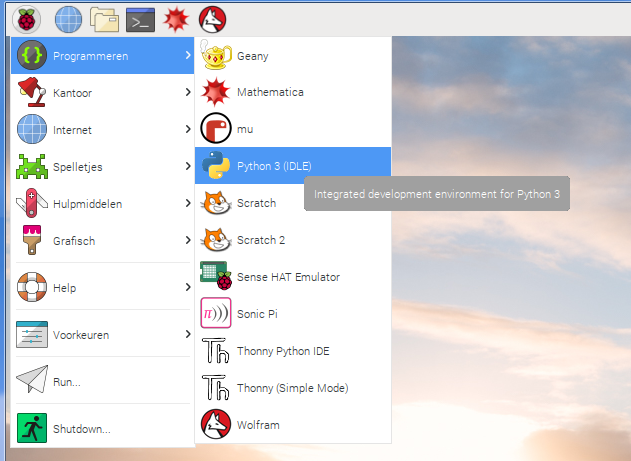

## Schrijf code om de motor te laten draaien

Nadat het wiel en de motoren zijn gemonteerd en bevestigd aan de Explorer HAT, is het tijd om ze te programmeren om te doen waarvoor ze zijn gebouwd ... draaien!

- Open in het menu `Programmeren` `Python 3 (IDLE)`
    
    

- Klik op **File** > **New file** om een ​​leeg bestand te maken.

- Begin de code door de Explorer HAT Python-bibliotheek te importeren die nodig is om de motor te besturen door te typen:
    
    ```python
    import explorerhat
    ```

- Daaronder importeer je de sleep function (slaap- of wachtfunctie) uit de bibliotheek `time`, zodat je tijdvertragingen kunt toevoegen aan je programma:
    
    ```python
    from time import sleep
    ```

- Voeg nu de reeks instructies toe om de aangesloten motor te besturen:
    
    ```python
    explorerhat.motor.one.forward(100)
    sleep(10)
    explorerhat.motor.one.stop()
    ```

- Sla je code op en start het programma door op **F5** op het toetsenbord te drukken. Je programma moet de motor aanzetten, waardoor de as die op het wiel is aangesloten, tien seconden lang draait. Hoe kun je hem langer laten draaien?