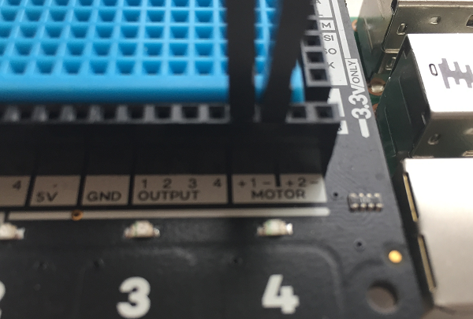

# Spinning Flower Wheel

## Attach the Explorer HAT to your Raspberry Pi

1. The Explorer HAT fits onto the GPIO pins on your Raspberry Pi. Before pushing it onto the GPIO pins, make sure that your Pi is turned off.

1. Connect your micro USB power supply, and your Raspberry Pi will boot.

## Prepare your motor and wheel

It is likely that your motors and wheels have been supplied separately and will therefore need to be connected in order for you to use them.

  

1. Place the wheel on a desk or table. Align the shaft of the motor with the wheel and press it gently until it is about half way into the wheel. If you are using a wheel which does not fit snugly onto the motor shaft, you may need to use a small amount of strong glue to attach it.

  

1. Next, take two female-to-male jumper cables and attach the female end to the prongs on the motor. If you are using a motor which does not have attachments for jumper leads already attached, you will need to strip the jumper leads and solder them to the motor's connectors.

  

1. Take a paper or plastic cup and, using some scissors or a sharp pencil, make a hole in the middle just a little smaller than the size of the motor.

1. Push your motor into the hole in the cup, so that the wheel sticks out of the bottom and the jumper wires come out of the top.

1. Turn your cup upside down on the table and connect the two jumper wires to your Explorer HAT board. Place one of the male connectors into **Motor 1 +**, and the other adjacent to it, in **Motor 1 -**. In this case it does not matter which way around you connect the wires.

    

## Decorate your wheel with a flower or pinwheel

Now that you have constructed your motor, it is time to decorate it. You can do this by cutting out flower shapes from different coloured paper or felt. Alternatively, you could make an [origami pinwheel out of paper](http://www.wikihow.com/Make-an-Origami-Pinwheel).

1. Place a ball of Blu Tack in the centre of the wheel.

1. Add your flower or pinwheel on top of the Blu Tack, ensuring that it is in the middle.

1. Secure the paper in place with a push pin.

1. You could get really creative with some wire to add insects like bumble bees around the outside! Remember the wheel is going to spin, so how could you take advantage of this in a creative way?

    

## Write code to make the motor turn

Once the wheel and motors have been assembled and attached to the Explorer HAT, it is time to program them to do what they were built for... turning!

1. From the `Programming` menu, open `Python 3 (IDLE)`

    

1. Click **File** > **New File** to create a blank file.

1. Begin your code by importing the Explorer HAT Python library needed to control the motor by typing:

    ```python
    import explorerhat
    ```

1. Underneath that, import the sleep function from the `time` library so that you can add time delays to your program:

    ```python
    from time import sleep
    ```

1. Now add the sequence of instructions to control the attached motor:

    ```python
    explorerhat.motor.one.forward(100)
    sleep(10)
    explorerhat.motor.one.stop()
    ```

1. Save your code and run the program by pressing `F5` on the keyboard. Your program should turn the motor on, which will spin the shaft connected to the wheel for 10 seconds. How could you make it spin for longer?

## Using a button to start your spinning program

The Explorer HAT also includes several input buttons. Let's use a button to start your spinning flower or pinwheel program when you want it to.

1. With your Python program open, navigate to just above `explorerhat.motor.one.forward(100)` and add a line to define a function called `run_motor`. Then, highlight the three lines of code which control the motor and press the `tab` key to indent them. They are now part of the function.

    ```python
    def run_motor(channel, event):
      explorerhat.motor.one.forward(100)
      sleep(10)
      explorerhat.motor.one.stop()
    ```
1. Underneath your function, add a line of code to tell the Explorer HAT to run the function when button one is pressed. This line of code should **not** be indented - it should be on the far left of the page.

  ```python
  explorerhat.touch.one.pressed(run_motor)
  ```

1. Save the amended code file and run it by pressing `F5`. Nothing will happen until you press button one on the Explorer HAT. So give it a go: press that  button!

## What next?

- Adapt your code in order to slow the speed of the motors
- Make your flower spin for a random length of time when the button is pressed, using the random library
- Add more motors to your Explorer HAT
- Watch [Make a Digital Garden with Carrie Anne](https://www.youtube.com/watch?v=4Fs7y7gZIag) for more ideas
- Use four motors to build a robot
