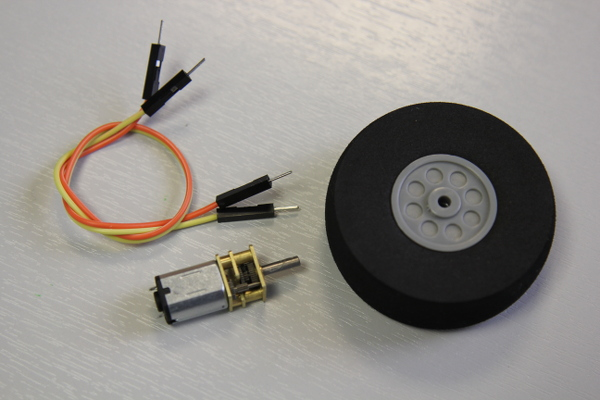
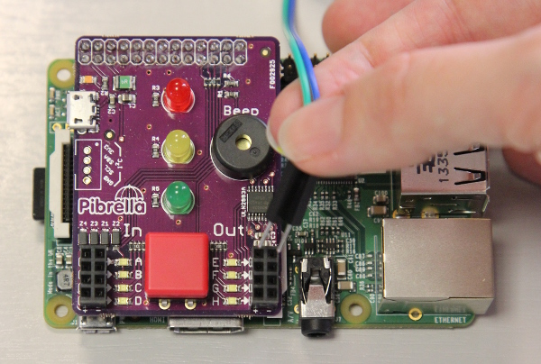
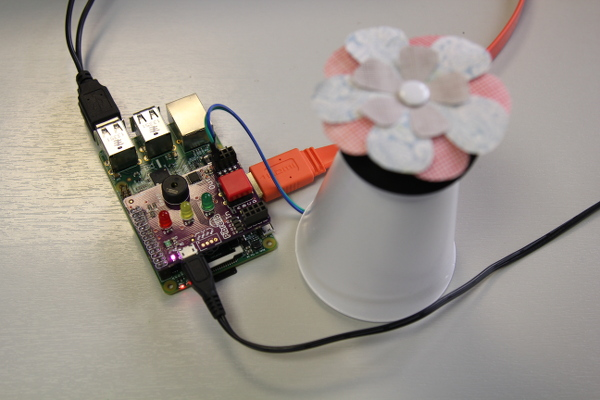

# Make a digital landscape of spinning flowers & pinwheels

## Step 1: Set up your Raspberry Pi to use Pibrella

1. The Pibrella fits onto the GPIO pins on your Raspberry Pi. Before pushing it onto the GPIO pins, make sure that your Pi is turned off.
1. Then connect your micro USB power supply to the Pibrella board, and your Raspberry Pi will boot. 

  *Note: To program your Pibrella, you can use [Scratch GPIO](http://scratchgpio.github.io) or Python. In this tutorial we will be using Python.* 

1. To program your Pibrella using Python, download and install the Pibrella Python Library by opening an LXTerminal window. First, make sure that *Raspbian* is up to date. 
1. Once you are satisfied that you have all the files you need, you can turn off your Raspberry Pi by double-clicking the `shutdown` desktop icon or by typing `sudo poweroff` on the command line. 

## Step 2: Prepare your motor and wheel

It is likely that your motors and wheels have been supplied separately and therefore need to be connected in order for you to use them. *Note: You may need to ask a responsible adult for some help in this step.*

  

1. Place the foam wheel on a desk or table, ensuring that you have placed some cardboard or newspaper underneath to protect the worksurface.
1. Put a small amount of strong glue into the hole in the centre of the wheel.
1. Push the shaft of your motor into the hole, ensuring that you do not push it all the way to the bottom (halfway should do). Hold it as straight as possible whilst the glue sets. 
1. Next, take two male-to-male jumper cables and snip off one end. Using some wire strippers, expose a small amount of the cable underneath.
1. Solder the wire ends to the opposite end of the motor to the wheel, where there are two small metal prongs. 
1. Once the solder has hardened, take a paper or plastic cup and using some scissors or a sharp pencil, make a hole in the middle just a little smaller than the size of the motor. 
1. Push your motor into the hole in the cup, so that the wheel sticks out of the bottom and the jumper wires come out of the top. 
1. Turn your cup upside down on the table and connect the two jumper wires to your Pibrella board. Place one of the male connectors into **Output E**, and the other adjacent to it in the ground bank of row **E**.

 

## Step 3: Decorate your wheel with a flower or pinwheel

Now that you have constructed your motor, it is time to decorate it. You can do this by cutting out flower shapes from different coloured paper or felt. Alternatively, you could make an [origami pinwheel out of paper](http://www.wikihow.com/Make-an-Origami-Pinwheel).

1. Place a ball of Blu Tack in the centre of the wheel.
1. Add your flower or pinwheel on top of the Blu Tack, ensuring that it is in the middle. 
1. Secure the paper in place with a push pin. 
1. You could get really creative with some wire to add insects like bumble bees around the outside! Remember the wheel is going to spin, so how can you take advantage of this in a creative way?

 

## Step 4: Write code to make the motor turn

Once the wheel and motors have been assembled and attached to the Pibrella, it is time to program them to do what they were built for... turning!

1. From the command line or an LXTerminal window type `nano spinning-wheel.py` and press **Enter** on the keyboard. This will open a blank text editor file in which you can type your code.
1. Begin your code by importing the Pibrella Python library needed to control the motor by typing: 
    
    ```python
    import pibrella
    ```
1. Underneath, import the `time` library in the same way so that you can add time delays to your program:

    ```python
    import time
    ```
1. Leave a blank line of code by pressing **Enter**.
1. Underneath, you can now write the sequence of instructions to control the attached motor: 

  ```python
  pibrella.output.e.on()
  time.sleep(10)
  pibrella.output.e.off()
  ```
  
1. Press **Ctrl** and **X** on the keyboard then **Y** to save your code.
1. Run your program by typing `sudo python spinning-wheel.py`.

    Your program should turn the motor on, which will spin the shaft connected to the wheel for 10 seconds. How could you make it spin for longer?
    
## Step 5: Using a button to start your spinning program

The Pibrella is capable of more than just outputting current to a motor in order for it to spin. It also includes a red input button. Let's use it to start your spinning flower or pinwheel program when you want it to.

1. From the command line or in an LXTerminal window, open your `spinning-wheel.py` Python program by typing `nano spinning-wheel.py` and pressing **Enter**.
1. Navigate using the arrow keys on your keyboard to just above `pibrella.output.e.on()` and add the following lines; note that indentation is important here. If you are using `nano`, ensure that you press the space bar four times to leave a four space indent:

  ```python
  import pibrella
  import time
  
  while True:
      if pibrella.button.read():
          pibrella.output.e.on()
          time.sleep(10)
          pibrella.output.e.off()
          break
  ```
1. Press **Ctrl** and **X** then **Y** to save the amended code file.
1. To run the new program, type `sudo python spinning-wheel.py` and press **Enter**.
 
 Nothing will happen until you press the red button on the Pibrella board. So give it a go; press that big red button!

## What's next?
- Adapt your code in order to slow the speed of the motors spinning
- Add more motors to your pibrella
- Watch [Make a Digital Garden with Carrie Anne](https://www.youtube.com/watch?v=4Fs7y7gZIag) for more ideas
- Use four motors to build a robot.
